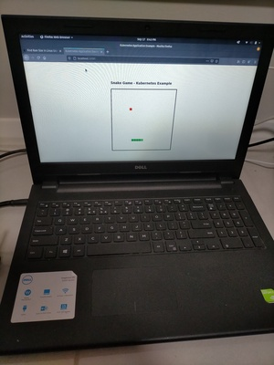

Got an old laptop that was running Ubuntu so thought of refreshing it and do something with Kubernetes. Download PopOS and installed it on the laptop and then start working on compiling, installing and running kubernetes from scratch.



Having complete installation of Kubernetes + Docker will help to make it easier to learn more about the internal working of the different pieces of the full container stack technology. 


Following are the steps that was performed:

- Switch off swap
	```
	sudo echo "vm.swappiness=0" | sudo tee --append /etc/sysctl.conf
	```

- Compile docker, runc, containerd and kubernetes from source code. Following are the github page.

	```
	* github.com/containerd/containerd
	* github.com/docker/cli
	* github.com/docker/docker
	* github.com/opencontainers/runc
	* github.com/kubernetes/kubernetes
	```

- Symlink the following files into /usr/local/bin
	
	```
	* containerd
	* containerd-shim
	* containerd-shim-runc-v2
	* ctr
	* docker
	* docker-init
	* dockerd
	* containerd
	* kubeadm
	* kube-apiserver
	* kube-controller-manager
	* kubectl
	* kubelet
	* runc
	```

- Following is how it looks like inside my local /usr/local/bin

```
root root   88 Sep XX XX:57 containerd -> /home/nanik/project/gopath/src/github.com/docker/docker/bundles/binary-daemon/containerd
root root   93 Sep XX XX:58 containerd-shim -> /home/nanik/project/gopath/src/github.com/docker/docker/bundles/binary-daemon/containerd-shim
root root  101 Sep XX XX:58 containerd-shim-runc-v2 -> /home/nanik/project/gopath/src/github.com/docker/docker/bundles/binary-daemon/containerd-shim-runc-v2
root root   81 Sep XX XX:58 ctr -> /home/nanik/project/gopath/src/github.com/docker/docker/bundles/binary-daemon/ctr
root root   77 Sep XX XX:49 docker -> /home/nanik/project/gopath/src/github.com/docker/cli/build/docker-linux-amd64
root root   89 Sep XX XX:58 dockerd -> /home/nanik/project/gopath/src/github.com/docker/docker/bundles/binary-daemon/dockerd-dev
root root   89 Sep XX XX:07 docker-init -> /home/nanik/project/gopath/src/github.com/docker/docker/bundles/binary-daemon/docker-init
root root   83 Sep XX XX:05 kubeadm -> /home/nanik/project/gopath/src/github.com/kubernetes/kubernetes/cmd/kubeadm/kubeadm
root root   90 Sep XX XX:44 kube-apiserver -> /home/nanik/project/gopath/src/github.com/kubernetes/kubernetes/_output/bin/kube-apiserver
root root   99 Sep XX XX:45 kube-controller-manager -> /home/nanik/project/gopath/src/github.com/kubernetes/kubernetes/_output/bin/kube-controller-manager
root root   83 Sep XX XX:06 kubectl -> /home/nanik/project/gopath/src/github.com/kubernetes/kubernetes/cmd/kubectl/kubectl
root root  103 Sep XX XX:50 kubelet -> /home/nanik/project/gopath/src/github.com/kubernetes/kubernetes/./_output/local/bin/linux/amd64/kubelet
root root   82 Sep XX XX:57 runc -> /home/nanik/project/gopath/src/github.com/docker/docker/bundles/binary-daemon/runc
```

- Create docker group and add current user to the group
	```
	sudo groupadd docker
	sudo usermod -aG docker nanik 
	```
- Copy the following config.toml to /etc/containerd for containerd 
	```
	subreaper = true
	oom_score = -999

	[debug]
		level = "debug"

	[metrics]
		address = "127.0.0.1:1338"

	[plugins.linux]
		runtime = "runc"
		shim_debug = true
	```
- All the .service files will need to be copied to /etc/systemd/system and given the proper permission using the following command

	```
	sudo chmod 664 /etc/systemd/system/<service_file_name>.service
	```

- Copy the following docker.service

	```
	[Unit]
	Description=Docker Application Container Engine
	Documentation=https://docs.docker.com
	BindsTo=containerd.service
	After=network-online.target firewalld.service containerd.service multi-user.target
	Wants=network-online.target
	#Requires=docker.socket

	[Service]
	Type=notify
	# the default is not to use systemd for cgroups because the delegate issues still
	# exists and systemd currently does not support the cgroup feature set required
	# for containers run by docker
	ExecStart=/usr/local/bin/dockerd -H unix:// --containerd=/run/containerd/containerd.sock
	ExecReload=/bin/kill -s HUP $MAINPID
	TimeoutSec=0
	RestartSec=2
	Restart=always

	# Note that StartLimit* options were moved from "Service" to "Unit" in systemd 229.
	# Both the old, and new location are accepted by systemd 229 and up, so using the old location
	# to make them work for either version of systemd.
	StartLimitBurst=3

	# Note that StartLimitInterval was renamed to StartLimitIntervalSec in systemd 230.
	# Both the old, and new name are accepted by systemd 230 and up, so using the old name to make
	# this option work for either version of systemd.
	StartLimitInterval=60s

	# Having non-zero Limit*s causes performance problems due to accounting overhead
	# in the kernel. We recommend using cgroups to do container-local accounting.
	LimitNOFILE=infinity
	LimitNPROC=infinity
	LimitCORE=infinity

	# Comment TasksMax if your systemd version does not support it.
	# Only systemd 226 and above support this option.
	TasksMax=infinity

	# set delegate yes so that systemd does not reset the cgroups of docker containers
	Delegate=yes

	# kill only the docker process, not all processes in the cgroup
	KillMode=process

	[Install]
	WantedBy=multi-user.target
	```

- Copy the following containerd.service

	```
	# Copyright The containerd Authors.
	#
	# Licensed under the Apache License, Version 2.0 (the "License");
	# you may not use this file except in compliance with the License.
	# You may obtain a copy of the License at
	#
	#     http://www.apache.org/licenses/LICENSE-2.0
	#
	# Unless required by applicable law or agreed to in writing, software
	# distributed under the License is distributed on an "AS IS" BASIS,
	# WITHOUT WARRANTIES OR CONDITIONS OF ANY KIND, either express or implied.
	# See the License for the specific language governing permissions and
	# limitations under the License.

	[Unit]
	Description=containerd container runtime
	Documentation=https://containerd.io
	After=network.target local-fs.target

	[Service]
	ExecStartPre=-/sbin/modprobe overlay
	ExecStart=/usr/local/bin/containerd

	Type=notify
	Delegate=yes
	KillMode=process
	Restart=always
	RestartSec=5
	# Having non-zero Limit*s causes performance problems due to accounting overhead
	# in the kernel. We recommend using cgroups to do container-local accounting.
	LimitNPROC=infinity
	LimitCORE=infinity
	LimitNOFILE=infinity
	# Comment TasksMax if your systemd version does not supports it.
	# Only systemd 226 and above support this version.
	TasksMax=infinity
	OOMScoreAdjust=-999

	[Install]
	WantedBy=multi-user.target
	```

- Copy the following kubelet.service

	```
	[Unit]
	Description=Kubernetes Kubelet Server
	Documentation=https://github.com/GoogleCloudPlatform/kubernetes
	After=docker.service
	Requires=docker.service

	[Service]
	WorkingDirectory=/var/lib/kubelet
	EnvironmentFile=-/etc/kubernetes/config
	EnvironmentFile=-/etc/kubernetes/kubelet
	ExecStart=/usr/local/bin/kubelet --kubeconfig=/etc/kubernetes/kubelet.conf --config=/var/lib/kubelet/config.yaml
	# $KUBE_LOGTOSTDERR  $KUBE_LOG_LEVEL  $KUBELET_API_SERVER  $KUBELET_ADDRESS $KUBELET_PORT  $KUBELET_HOSTNAME $KUBE_ALLOW_PRIV  $KUBELET_POD_INFRA_CONTAINER $KUBELET_ARGS
	Restart=on-failure

	[Install]
	WantedBy=multi-user.target
	```

- Enable, run and check containerd.service

	```
	sudo systemctl enable containerd.service 
	sudo systemctl start containerd.service 
	sudo systemctl status containerd.service 
	```

- Enable, run and check docker.service

	```
	sudo systemctl enable docker.service 
	sudo systemctl start docker.service 
	sudo systemctl status docker.service 
	```

- Enable, run and check kubelet.service

	```
	sudo systemctl enable kubelet.service 
	sudo systemctl start kubelet.service 
	sudo systemctl status kubelet.service 
	```

- Pre-download all images required for Kubernetes using the following 

	```
	kubeadm config images pull
	```
	
- Use the kubeadm to init and run Kubernetes

	```
	sudo kubeadm init --ignore-preflight-errors=SystemVerification,KubeletVersion
	```

- Execute the following command to allow pods to run inside the master node

	```
	kubectl taint nodes --all node-role.kubernetes.io/master-
	```
